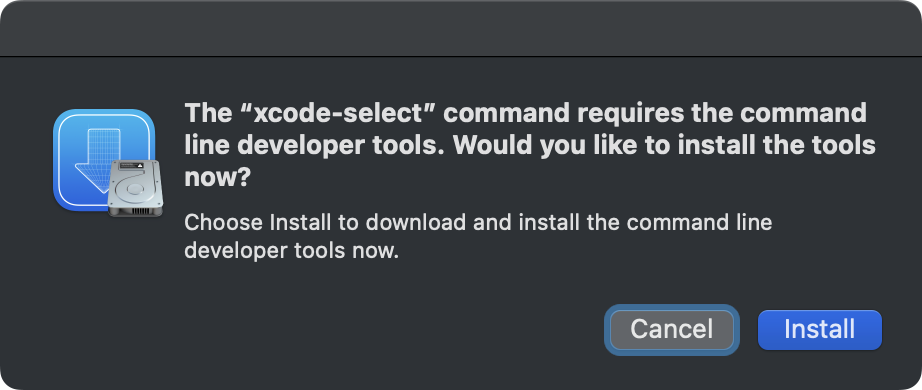

# Move Mail Message

*Copyright 2026 Caleb Evans*  
*Released under the MIT license*

Move Mail Message is an [Alfred][alfred] workflow that enables you to quickly move one or more messages in the Apple Mail app to a different folder. You can search and filter down to the destination folder of your choice with just a few keystrokes.

[alfred]: https://www.alfredapp.com/

## Installation

To download the workflow, simply click one of the download links below.

*Download links TBD*

### Command Line Tools

If you are installing the workflow for the first time, you may be prompted to
install Apple's Command Line Tools. These developer tools are required
for the workflow to function, and fortunately, they have a much smaller size
footprint than full-blown Xcode.

